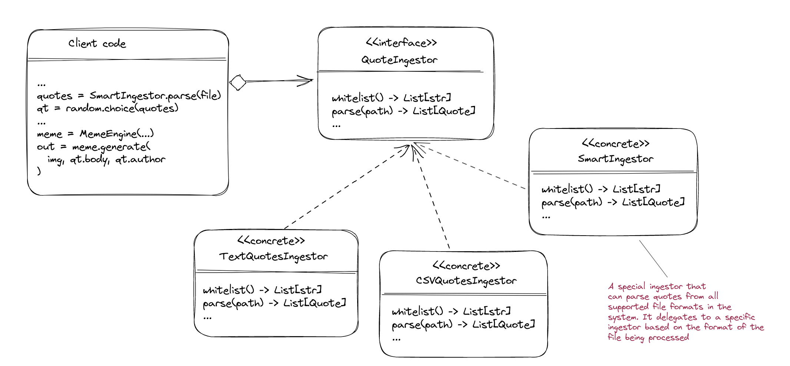
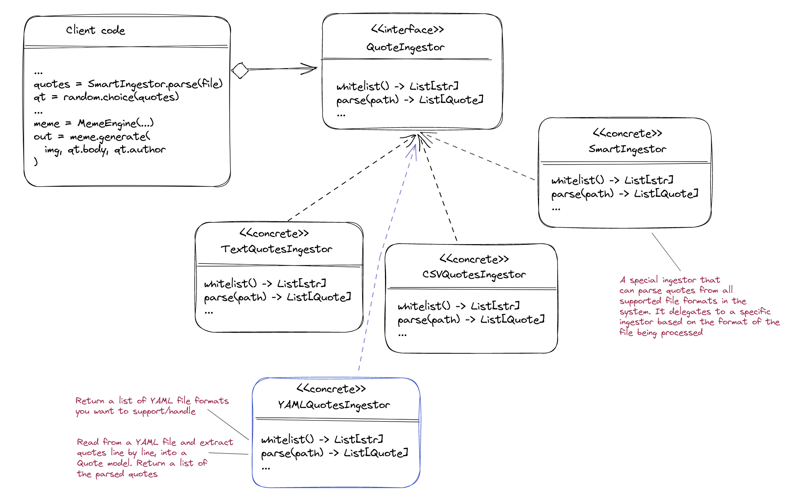

# turbo-meme-gen

[](https://www.codacy.com/gh/chalu/turbo-meme-gen/dashboard?utm_source=github.com&amp;utm_medium=referral&amp;utm_content=chalu/turbo-meme-gen&amp;utm_campaign=Badge_Grade)

A simple meme generator exposed as a CLI, web app, and REST API. You can specify an image and a quote (the quote text and author) and you'll get back a meme composed of the quote layered over the image. See below for some sample memes generated from the command line :point_down: :point_down:


<br>


### Usage:

1.  CLI - generate memes from the command line
    -   clone the [github repo](https://github.com/chalu/turbo-meme-gen) and cd into the `src` folder inside the repo's folder
    -   run `pip install -r requirements.txt` to installs dependencies and setup the environment
    -   run `python3 meme.py` to generate a random meme from our collection of images and quotes. You can also use the `--quotes` and `--images` to specify folders containing your collection of quotes and images to generate from. See the **How It Works** section for details on how the quotes files are to be structured if you plan to extend the system or provide custom quotes with the `--quotes` option
    -   run `python3 meme.py --body "nice quote" --author "Someone" --path "relative/path/to/img.jpg|jpeg|png|gif|..."` to generate a meme using the provided image and quote body/author.

2.  Web App - generate memes on the web
    -   Go to https://turbo-meme-generator.onrender.com
    -   Click the **Generate** button to see randonly generated memes or use the **Make Yours** form to specify a quote and an image to generate a meme from

3.  REST API
    -   Make a `GET` request to https://turbo-meme-generator.onrender.com E.g `curl -H "Content-type: application/json" "https://turbo-meme-generator.onrender.com"`
    -   Make a `POST` request to https://turbo-meme-generator.onrender.com with a JSON body containing the quote, author and image URL like <br>
    ```bash
    curl -X POST "https://turbo-meme-generator.onrender.com/create" \
    -H "Content-type: application/json" \
    -d '{"image_url": "https://dailypost.ng/wp-content/uploads/2023/02/Peter-Obi.jpg", "body": "Vote mama, papa, pikin", "author": "Peter Obi"}'
    ```
    <br>
    Both the `POST` and `GET` requests should return a response payload like <br>
    ```json
    {
        "meme": "https://turbo-meme-generator.onrender.com/static/meme-image.jpg"
    }
    ```

## How It Works

> **Quotes files** are simple files containing a quote per line. A line of quote is a simple text where the **-** character separates the text of the quote from the author. E.g a .txt or .pdf quotes file can have multiple lines like :point_down: :point_down:  <br > `People will never forget how you made them feel - Maya Angelou` <br >  Out of the box, supported quote file formats are .txt, .pdf, .csv, and .docx
---
> **Images** from which to generate the memes can be any of the popular image formats. So far, we've tested with .jpg | jpeg, and .png, but I don't see why webp won't be supported :grin:

### Modules

Under the hood, the system uses a number of submodules to handle specific aspects of generating and serving memes.

*   **QuoteEngine Module** - Uses a class heirarchy strutured after the strategy design pattern to handle parsing and reading of quotes from files. It's job is to return a list of `Quotes` from supported files, or raise an exception if something goes wrong. It relies on some 3rd party libraries/tools (like python-docx and xpdf) to parse files
<br >



*   **MemeEngine Module** - Uses the Pillow library to generate memes. It draws a random quote on a random/provided image, which it returns as a meme with a max-height of `500px`

*   **Entrypoints** - Though not typical modules, meme.py and app.py aresrc entrypoints for generating and serving memes from the comand line and the web, respectively

## Entending It - Adding A Parser/Ingestor for YAML Files

1.  Creat a `YAMLQuotesIngestor` within the `quoteengine` module. It should extend and implement the abstract `QuoteIngestor` class

2.  Add your new parser/ingestor into the `SmartIngestor`
    -   import it, e.g `from .yml_ingestor import YAMLQuotesIngestor as YAMLIngest`
    -   include the imported parser in the returned list in the `ingestors()` method <br>
    ```python
    @classmethod
    def ingestors(cls) -> List[QuoteIngestor]:
        return [..., YAMLIngest]
    ```

3.  Add your YAML quotes file into the `src/_data` folder of the codebase and proceed to generate random memes, which should include quotes from your YAML file. Alternatively, run the meme generator with the `--quotes` option pointing to a directory containing your YAML quotes file

<br>



<br>